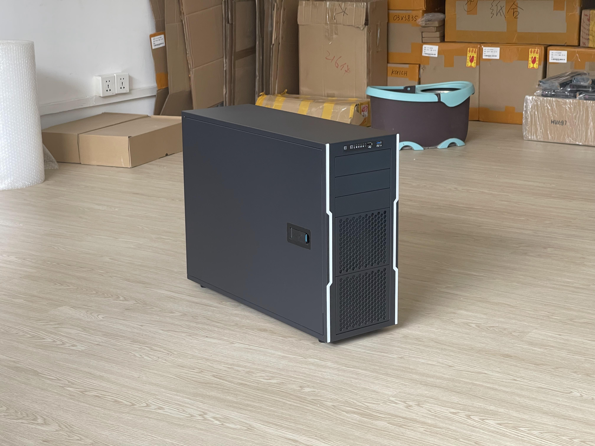
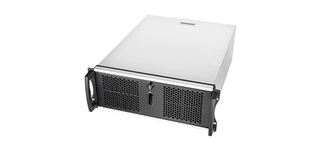
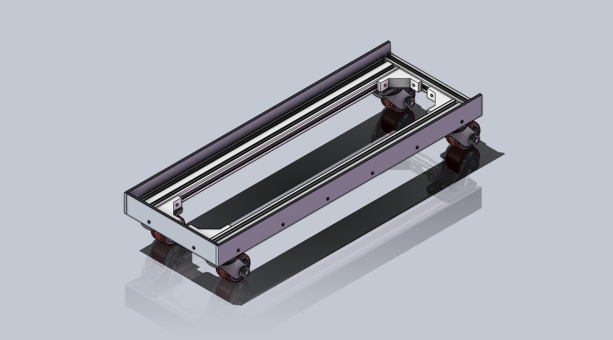
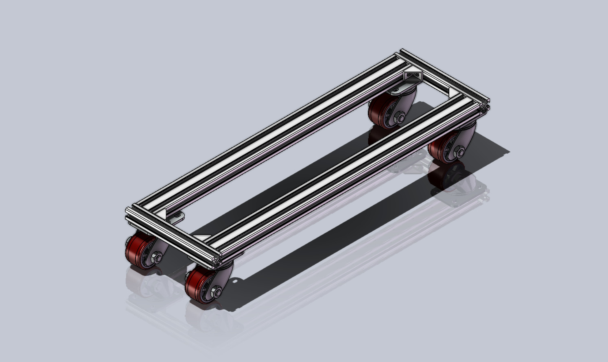
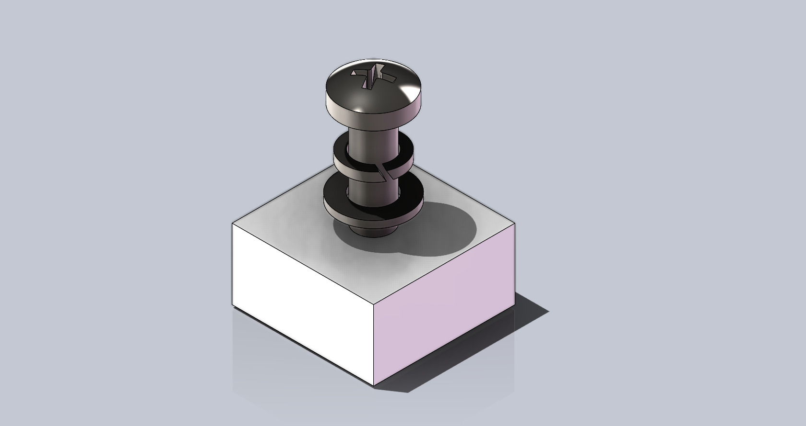
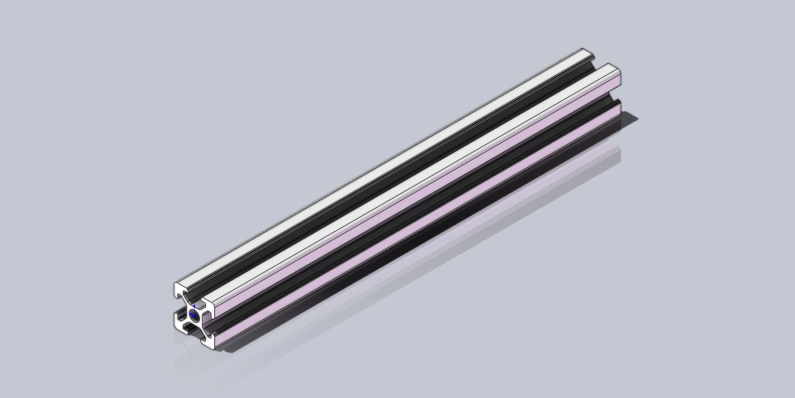
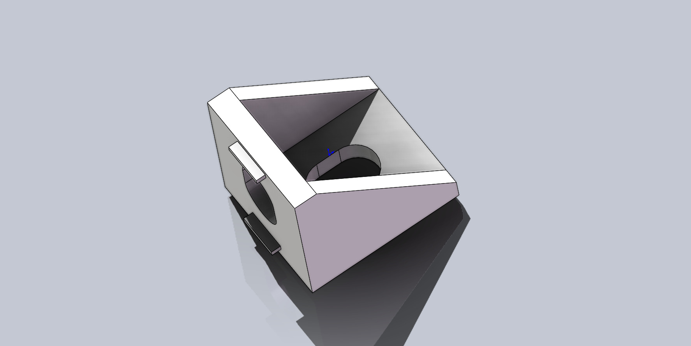
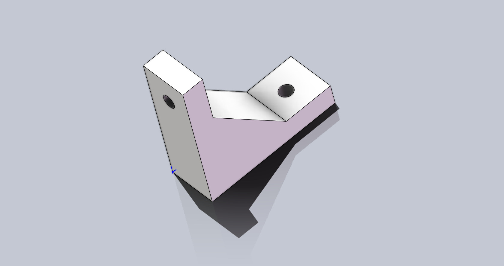
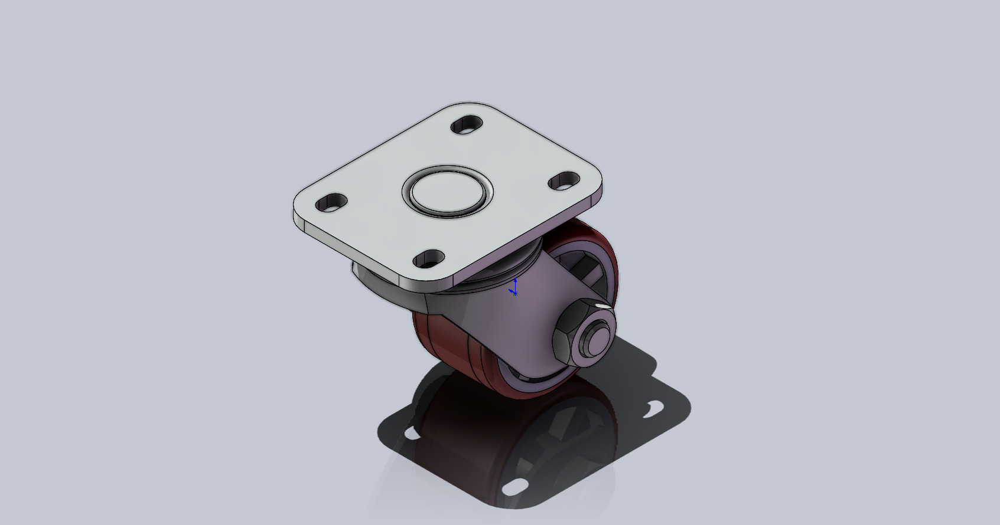

# AMX Chassis Bracket

    
    

    
    

## Introduction

This project starts with a PC building in June 2022, I found it is difficult to moving my heavy chassis. Besides, existing chassis brackets on Taobao is either unstable or too expensive(over 200 yuan). Therefore I decided to build the bracket by myself. 

The project aims to provide a fully open source solution of the chassis bracket with advantages below:

- **Fit**  Tailor-made according to the actual size of the chassis to meet your various obsessive-compulsive disorders.
- **Stable**  Aluminum Profile(AP) can support any heavy chassis. Will it shake? IMPOSSIBLE!!! It is much better than any one you can buy online.
- **Cool**  Hollowing out at the bottom is beneficial for heat dissipation of some chassis with vents at the bottom.
- **Quiet** Rubber casters can absorb vibration well.
- **Customizable** All accessories are customizable, you can choose freely according to your needs.

Finished parts(casters) and standard parts(AP) are widely used to reduce costs. However, **it might NOT be so cheap** because the cost of small parts such as screws is also considerable. According to my previous cases, **the total cost range is about 100-160 yuan.** In short, this solution might not be suitable for users who are **extremely cost-sensitive**.

## Compatible Chassis
Currently, I have implemented the following chassis brackets:
- [Dragon 1](chassis/Dragon_1/README.md)
- [RM41300](chassis/RM41300/README.md)

If you have new ideas, welcome to raise an issue~

## Before You Start

### How to use T-Nut
[Bilibili(Chinese)](https://player.bilibili.com/player.html?isOutside=true&aid=917693577&bvid=BV1tu4y1Y7eb&cid=1313380385&p=1),
[Youtube(English)](https://www.youtube.com/watch?v=_kZTA5S2jWY)

### How and Why to use Washer
[Bilibili(Chinese)](https://www.bilibili.com/video/BV1Qz4y1T7m6/?share_source=copy_web&vd_source=c79616b3b42ebfb1c3a4223d9ffdf564),
[Youtube(English)](https://www.youtube.com/watch?v=lbIHMyxHkds)

### Recommended Assembly

    

From top to bottom in the fig are **screws, spring washers, flat washers, and part to be installed**.

### Standard Part
**Aluminum Profile**

    

**Corner Connector**

    
    

The left is the standard 2020 corner connector. It can be purchased in any store that specializes in AAF.
The right is a widened corner connector with better structural strength. It is provided by the store where I bought. I believe other store also have similar part. The size might not be the same. 

### Casters

    

