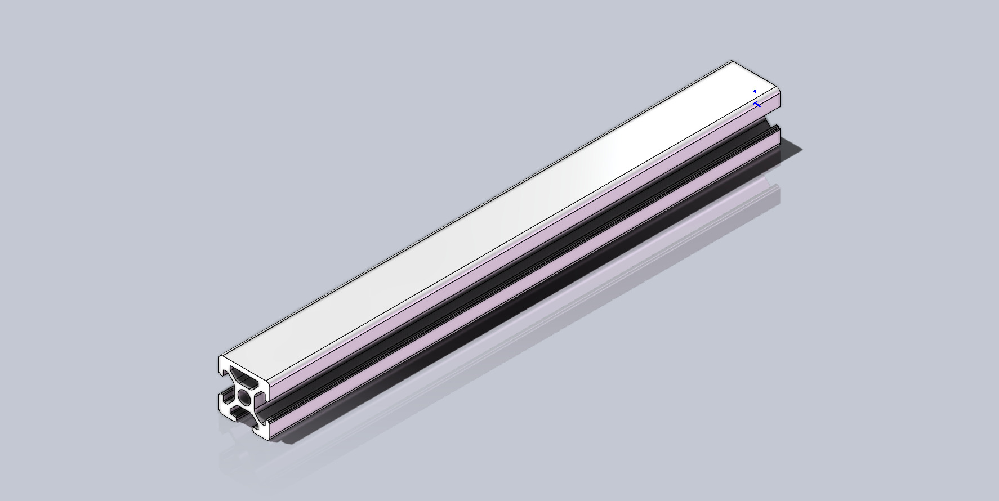
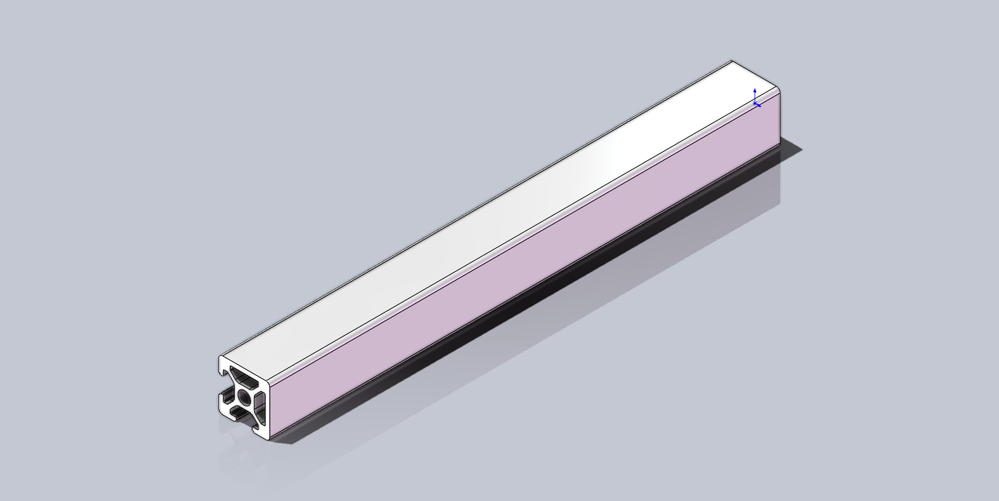
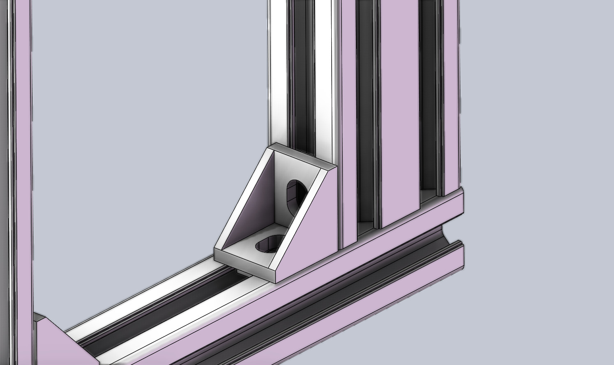

# AMX Chassis Bracket
<div align="center">
    
    
</div>
<div align="center">
    
    
</div>

## Introduction

This project starts with a PC building in June 2022, I found it is difficult to moving my heavy chassis. Besides, existing chassis brackets on Taobao is either unstable or too expensive(over 200 yuan). Therefore I decided to build the bracket by myself. 

The project aims to provide a fully open source solution of the chassis bracket with advantages below:

- **Fit**  Tailor-made according to the actual size of the chassis to meet your various obsessive-compulsive disorders.
- **Stable**  Aluminum Profile(AP) can support any heavy chassis. Will it shake? IMPOSSIBLE!!! It is much better than any one you can buy online.
- **Cool**  Hollowing out at the bottom is beneficial for heat dissipation of some chassis with vents at the bottom.
- **Quiet** Rubber casters can absorb vibration well.
- **Customizable** All accessories are customizable, you can choose freely according to your needs.

Finished parts(casters) and standard parts(AP) are widely used to reduce costs. However, **it might NOT be so cheap** because the cost of small parts such as screws is also considerable. According to my previous cases, **the total cost range is about 120-180 yuan.** In short, this solution might not be suitable for users who are **extremely cost-sensitive**.

## Compatible Chassis
Currently, I have implemented the following chassis brackets:
- [Dragon 1](chassis/Dragon_1/README.md)
- [RM41300](chassis/RM41300/README.md)

If you have new ideas, welcome to raise an issue~

## Before You Start

### Default Units

**This project uses millimeters(mm) as the unit of length by default!!!** 
Special cases will be specifically pointed out.

### How to use T-Nut
[Bilibili(Chinese)](https://player.bilibili.com/player.html?isOutside=true&aid=917693577&bvid=BV1tu4y1Y7eb&cid=1313380385&p=1),
[Youtube(English)](https://www.youtube.com/watch?v=_kZTA5S2jWY)

### How and Why to use Washer
[Bilibili(Chinese)](https://www.bilibili.com/video/BV1Qz4y1T7m6/?share_source=copy_web&vd_source=c79616b3b42ebfb1c3a4223d9ffdf564),
[Youtube(English)](https://www.youtube.com/watch?v=lbIHMyxHkds)

### Recommended Assembly
<div align="center">
    
</div>

From top to bottom in the fig are **screws, spring washers, flat washers, and part to be installed**.

### Standard Part
#### Aluminum Profile
Aluminum profiles are versatile components widely used in various industries, including construction, automotive, and manufacturing. These profiles are typically created through an extrusion process, where heated aluminum alloy is forced through a die to achieve specific shapes and sizes.

T-slot aluminum(TSA) is a type of extruded aluminum profile that features a T-shaped slot running along its length. This design allows for easy and flexible connection of different aluminum profiles using a variety of connectors, fasteners, and accessories. So this project use it as the main support component. 

<div align="center">
    
</div>

Model name of the TSA is based on the cross-sectional dimensions. E.g. the cross-sectional dimension of 20 mm in both width and height is named 2020. Common models are 1515, 2020, 2040, 2060, 3030...

**This project mainly uses the Model 2020 and 2040 to get a good balance between cost and stiffness.**

In addition, there are variants of single-sided or even multi-sided closure of TSA:
<div align="center">
    
    
</div>

#### Corner Connector

Corner connector is one of the most common fastener used for TSA. It has a variety of sizes, corresponding to different models of TSA.

<div align="center">
    
    
</div>

The left is the standard corner connector. It can be purchased in any store that specializes in TSA.
The right has better structural strength(also a little more expensive). It is provided by the store where I bought. I believe other store also have similar part. The size might not be the same. 

**You can choose flexibly according to the actual situation.**

Fig below is an example of its' usage:
<div align="center">
    
</div>

### Caster

The caster is the core to the free movement of the chassis. Reliable castor is equipped with a variety of bearings to support pressure while meeting the need for smooth movement. Of course, this also leads to the fact that this part may be a little expensive (around 20-30 yuan per set).

<div align="center">
    
</div>

According to the size of the wheel diameter, the common casters are 1-inch, 1.25-inch, 1.5-inch, 2-inch, etc... 

**It is important to note that casters that are too small have a very limited load capacity, and casters that are too large will cause the center of the chassis gravity to be too high and cause instability**

Based on previous experience, **it is recommended to use casters of 1.5-inch**.

## Design and Review
### Prerequisites
- Dassault Systèmes' SOLIDWORKS 2024 and higer

### Folder Structures
```
|-- AMX Classis Bracket
            |
            |---- chassis Parts and assemblies of brackets for different chassis
            |       |
            |       |---- share Shared parts(corner connector, caster...)
            |       |
            |       |---- Dragon_1 
            |       |
            |       |---- RM41300
            |       :
            |       :
            |       |---- Other Classis
            |
            |---- drawing Machining drawings
            |
            |---- image Images used in README
```

