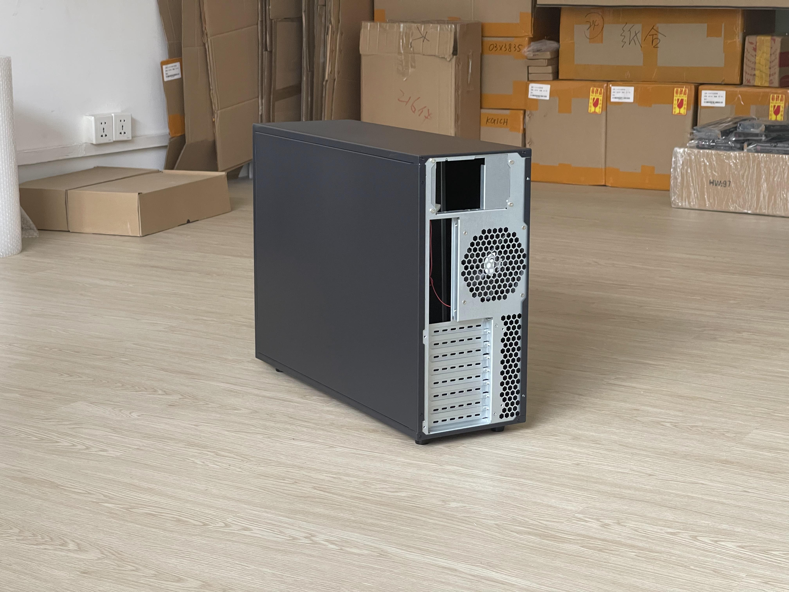
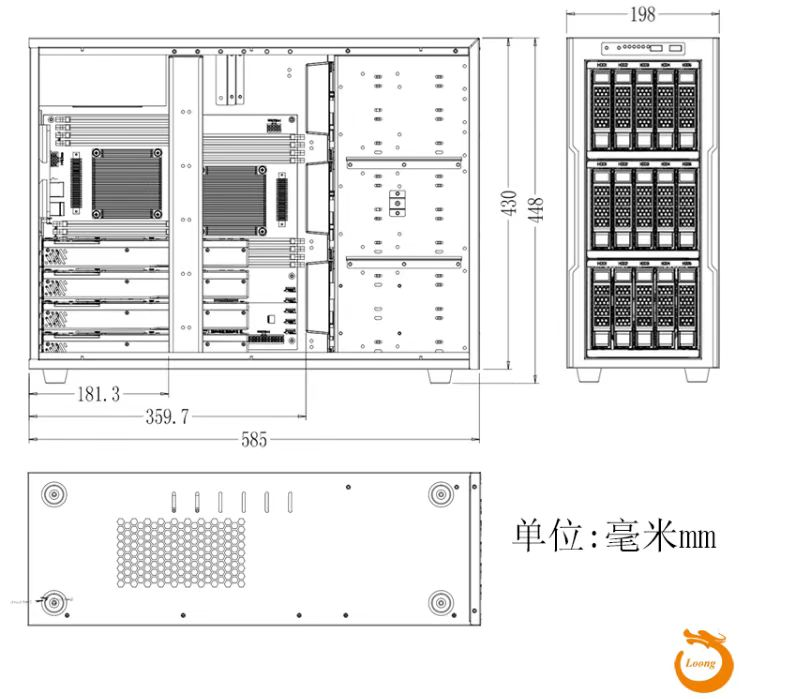

# Dragon 1

    
    

    

## Chassis Bracket

    
    

## BOM

| Name                 | Model                      | Spec        | Drawing | Quantity | Price(yuan) |               Note              |
|:--------------------:|:--------------------------:|:-----------:|:-------:|:--------:|:-----------:|:-------------------------------:|
| TSA                  | 2020                       | Length: 200 |         | 2        | 5.54        |  Recommend single-sided closure |
|                      | 2040                       | Length: 545 |         | 2        | 25.51       |  Recommend single-sided closure on 40 side |
| Corner Connector     | Compatible to Model 20 TSA |             |         | 4        | 9.8         |                          |
| Aluminum Panel       | Thick: 5, Width: 40        | Length: 200 | [c0](../../drawing/cover5X40X200.pdf) | 1        | 3.17        |   Send drawing to the manufacturer*  |
|                      |                            | Length: 590 | [c1](../../drawing/cover5X40X590.pdf) | 2        | 18.71       |   Send drawing to the manufacturer   |
| Caster               | 1.5-inch                   |             |         | 1 set    | 30          |  1 set include 4 casters    |
| Washer               | Spring Washer              | M5          |         | 20       | 6.8         |                          |
|                      | Flat Washer                | 5\*12\*1.0  |         | 20       | 6           |                          |
| Hexagon Socket Screw | Round Head                 | M5*8        |         | 20       | 5           |                          |
|                      | Flat Head Chamfered        | M5*10       |         | 14       | 5.85        |  For fastening side panels |
| T-Nut                | Compatible to Model 20 TSA | M5          |         | 34       | 3.4         |                          |
| Rubber Feet**        | D: 40, Thick: 8            |             |         | 4        | 8           |                          |
| Miscellaneous***     |                            |             |         |          | 35          |                          |
| Total                |                            |             |         |          | 168         |                          |

*note: Holes need to be drilled, so the drawing must be sent to the manufacturer!

**note: As shown in the fig below:

    

***note: Include machining, freight, etc.

## Prerequisites

- Hexagonal Wrench
- Small File
- Phillips Screwdriver

## How to Install

    
    

    
    

    
    

1. Connecting TSA using corner connector. Pay attention to the assembly order! It is recommended to assemble on a flat surface (such as the ground)
2. Install the rear side panel*.
3. Install the left and right side panels. They can wrap the rear side panel.
4. Install casters.
5. Remove the original feet installed under the chassis.
6. Place the rubber feet on the bracket.
7. Place the chassis on the bracket.

*note: When installing the side panels, washers can be omitted for aesthetic reasons, so that the screw heads can fit perfectly with the side panels.

## Caution

The cut edges of the side panels and cornet connector may be sharp, so it is recommended to use a file for chamfering.
